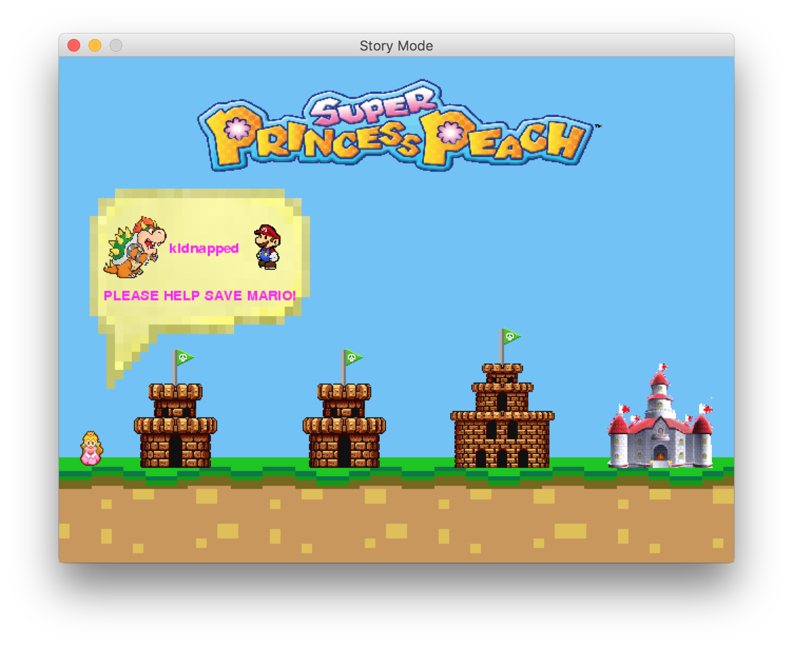

# Super-Princess-Peach :princess: :peach:
A python based Super Princess Peach game that contains several mini-games in it such as Brick Break, Simon, and Snake.

**Created by:** Sam Kustin, Adam Nieto, Amy Chen, Melissa Wolff

## About the Game

There are two modes in this game.

**Mini Game Mode:** Play all three mini games (brick breaker, simon, and snake) in any order you want and as many times as you want.

**Story Mode:** Help Princess Peach save Mario from the clutches of Bowser by aiding her through castles which hold a mini game. In order to defeat the castle, you must win the mini game. You have unlimited tries to beat the Mini Game if you fail but if you give up and quit, you lose the story mode game. However, if you win all three mini games, you save Mario!

## Getting Started
1. Install Python 3+ 
2. Install pygame (https://www.pygame.org/wiki/GettingStarted)
3. Take the images and sounds out of their folders. Make sure they are on the same level as the **.py** files.
4. Start the game by running **mainModule.py**
5. Have fun!

